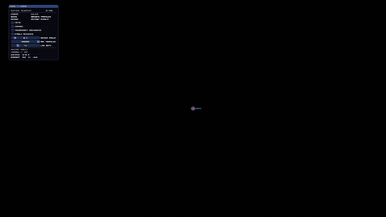

# PhysX Creation

A Windows C++20 application designed specifically for DMA hardware. It reads game data, processes PhysX scene geometry, and displays a real-time DirectX 11 overlay. The memory layer can be modified to support other read methods.

## Features

- Real-time camera and scene updates
- PhysX geometry collection and processing
- DirectX 11 rendering
- ImGui user interface
- Multithreaded data and rendering workflow
- DMA-based memory access through VMM/LeechCore
- Adaptable memory layer for other read methods

## Requirements

- Windows 10 or later
- Visual Studio with C++ desktop development tools
- C++20 support
- Embree 4 and TBB
- DMA hardware with VMM/LeechCore libraries

## Build

1. Open `physx_creation.slnx` in Visual Studio.
2. Confirm the dependency paths in the project settings.
3. Select `x64` and `Release` or `Debug`.
4. Build and run the project.

Generated files and build output are excluded by `.gitignore`.

## Showcase

## Disclaimer

This project is currently configured for Escape from Tarkov. It may be adapted for other games that use PhysX, but game-specific offsets and data structures must be updated first. At minimum, update the PhysX SDK offset and rigid actors offset.

Other likely updates include:

- How camera information is located and read
- Camera position, view, and projection data structures
- Module names and game process initialization
- PhysX world or scene pointers
- Entity, transform, and player data offsets
- Any game-specific validation or filtering logic

Use this project only with software and systems you own or have permission to inspect. Follow the applicable software terms, game rules, and laws.
